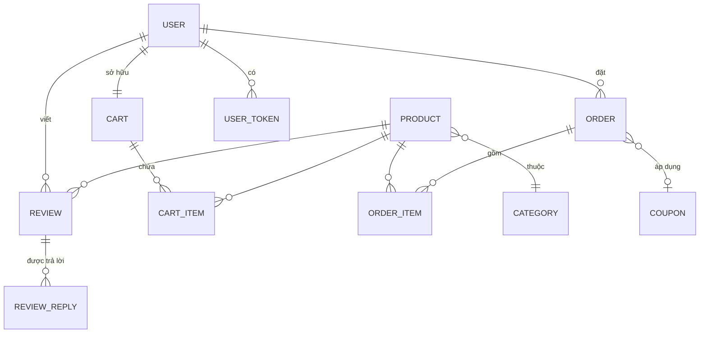

# Nike Shop — Website bán giày (Spring Boot)

Ứng dụng thương mại điện tử bán giày, xây dựng bằng **Spring Boot 3.5 + Thymeleaf + PostgreSQL**. Một ứng dụng duy nhất phục vụ cả hai phía: giao diện người mua (server-side rendering) và trang quản trị, đồng thời expose REST API có tài liệu Swagger.

| | |
|---|---|
| Backend | Java 17, Spring Boot 3.5.5, Spring Security + JWT, Spring Data JPA |
| Database | PostgreSQL 16 (Docker), Hibernate `ddl-auto=update` |
| View | Thymeleaf + SiteMesh 3 + Layout Dialect, Bootstrap, AdminLTE |
| Khác | MapStruct, Lombok, springdoc-openapi (Swagger UI), Spring Mail, VNPay |

---

## Tính năng

**Phía khách hàng**

- Đăng ký / đăng nhập bằng JWT (access token + refresh token qua cookie), xác thực email, quên & đặt lại mật khẩu.
- Đăng nhập OAuth2 với Google và Facebook.
- Duyệt sản phẩm theo danh mục, lọc và xem chi tiết (nhiều ảnh, mô tả, tồn kho).
- Giỏ hàng, áp mã giảm giá, thanh toán và xem lịch sử đơn hàng.
- Thanh toán VNPay (kèm trang callback) bên cạnh COD.
- Đánh giá sản phẩm, admin có thể trả lời đánh giá.

**Phía quản trị** (`/admin/...`)

- Dashboard: thống kê, biểu đồ doanh thu, top sản phẩm, phân bố trạng thái đơn.
- Quản lý sản phẩm, danh mục, đơn hàng, người dùng, mã giảm giá và đánh giá.

---

## Kiến trúc

Code tổ chức theo **package-by-feature**, mỗi feature có đủ tầng `controller → service → repository` cùng `entity`, `dto`, `mapper`:

```
src/main/java/com/proj/webprojrct/
├── auth/          đăng ký, đăng nhập, JWT, refresh token, xác thực email
├── user/          người dùng, vai trò, user token
├── product/       sản phẩm, size, màu, lọc sản phẩm
├── category/      danh mục
├── cart/          giỏ hàng và item trong giỏ
├── order/         đơn hàng và chi tiết đơn
├── promotion/     mã giảm giá (coupon)
├── review/        đánh giá + phản hồi của admin
├── payment/       tích hợp VNPay
├── notification/  thông báo
├── email/         gửi email
├── admin/         API + trang quản trị (dashboard, product, order, user, review)
├── common/        base entity, exception, mapper, security config, tiện ích
└── config/        Swagger, view controller, error controller
```

Mỗi feature thường có 2 controller: một cho **REST API** (`/api/v1/...`) và một cho **trang Thymeleaf** (ví dụ `CartController` vs `CartWebController`).

### Mô hình dữ liệu



Một số giá trị enum / trạng thái:

| Nơi | Giá trị |
|---|---|
| `UserRole` | `ROOT`, `ADMIN`, `MANAGER`, `STAFF`, `MEMBER`, `GUEST` |
| `Order.status` | `pending`, `confirmed`, `shipping`, `completed`, `canceled` (kiểu `String`) |
| `Order.paymentMethod` | `COD`, `Momo`, `VNPay`, `PayPal` |
| `EDiscountType` | `PERCENTAGE`, `FIXED_AMOUNT` |
| `Size` / `Color` | Enum đã khai báo (`SIZE_36`…`SIZE_45`, `BLACK`, `WHITE`, …) nhưng **chưa gắn vào** `Product` |

---

## Cài đặt & chạy

**Yêu cầu:** JDK 17+, Maven (hoặc dùng `./mvnw`), Docker.

### 1. Khởi động PostgreSQL

```bash
# Linux
sudo docker compose -f postgreSQL.yaml up -d --build

# Windows
docker compose -f postgreSQL.yaml up -d --build
```

Container `postgres` sẽ chạy ở **cổng 5433** (map từ 5432 trong container), database `cps_db`, user/password `cps`/`cps`, và tự chạy [`db/init.sql`](db/init.sql) ở lần khởi tạo đầu tiên.

### 2. Build & chạy ứng dụng

```bash
mvn clean install -DskipTests
mvn spring-boot:run
```

| Địa chỉ | Nội dung |
|---|---|
| http://localhost:8080 | Trang chủ |
| http://localhost:8080/admin/dashboard | Trang quản trị |
| http://localhost:8080/swagger-ui/index.html | Swagger UI |
| http://localhost:8080/v3/api-docs | OpenAPI JSON |

Dữ liệu mẫu trong [`src/main/resources/data.sql`](src/main/resources/data.sql) được nạp mỗi lần khởi động (`spring.sql.init.mode=always`), gồm sẵn vài tài khoản demo như `admin@example.com`.

### Reset database

```bash
docker volume rm webproject_postgres_data
docker compose -f postgreSQL.yaml up -d --build
```

> Tên volume phụ thuộc vào tên thư mục project. Chạy `docker volume ls` để lấy tên chính xác nếu lệnh trên báo không tìm thấy.

### Thao tác trực tiếp với DB

```bash
docker exec -it postgres bash
psql -U cps -d cps_db
```

---

## API chính

Toàn bộ endpoint có trong Swagger UI. Các nhóm chính:

| Nhóm | Base path | Ghi chú |
|---|---|---|
| Auth | `/api/v1/auth` | `register`, `login`, `refresh`, `logout`, `forgot-password`, `verify/{token}` |
| User | `/api/v1` | Thông tin và cập nhật người dùng |
| Product | `/api/v1` | Danh sách, chi tiết, lọc sản phẩm |
| Category | `/api/categories` | Danh mục |
| Cart | `/api/v1/carts` | Giỏ hàng |
| Order | `/api/v1/orders` | Đặt hàng, tra cứu đơn |
| Coupon | `/api/v1/coupons` | Kiểm tra và áp mã giảm giá |
| Review | `/reviews` | Đánh giá sản phẩm |
| Admin | `/admin/api/*`, `/api/admin/*` | Dashboard, sản phẩm, người dùng, đơn hàng, đánh giá |

Trang Thymeleaf: `/`, `/login`, `/register`, `/forgot-password`, `/products`, `/carts`, `/orders`, `/admin/dashboard`, `/admin/products`, `/admin/categories`, `/admin/coupons`, `/admin/orders`, `/admin/users`.

---

## Cấu hình

Toàn bộ nằm trong [`src/main/resources/application.properties`](src/main/resources/application.properties). Các giá trị cần thay khi chạy thật:

| Thuộc tính | Mặc định trong repo |
|---|---|
| `spring.datasource.url` | `jdbc:postgresql://localhost:5433/cps_db` |
| `jwt.secret` | Giá trị hardcode sẵn — **cần thay** |
| `jwt.access-token-expiration.ms` | `36000000` (10 giờ) |
| `jwt.refresh-token-expiration.ms` | `86400000` (24 giờ) |
| `spring.mail.username` / `password` | placeholder `your-email@gmail.com` — cần app password của Gmail |
| `spring.security.oauth2.client.registration.google.*` | placeholder — cần client id/secret thật |
| `spring.security.oauth2.client.registration.facebook.*` | placeholder — cần app id/secret thật |

Có thể override bằng biến môi trường thay vì sửa file, ví dụ:

```bash
SPRING_DATASOURCE_URL=... JWT_SECRET=... mvn spring-boot:run
```

---

## Tài liệu bổ sung

Các ghi chú kỹ thuật trong repo:

- [`PRODUCT_DATABASE_IMPLEMENTATION.md`](PRODUCT_DATABASE_IMPLEMENTATION.md) — thiết kế phần sản phẩm
- [`PRODUCT_FILTER_API.md`](PRODUCT_FILTER_API.md) — API lọc sản phẩm
- [`PRODUCTS_PAGE_GUIDE.md`](PRODUCTS_PAGE_GUIDE.md) — trang danh sách sản phẩm
- [`COUPON_APPLICATION_GUIDE.md`](COUPON_APPLICATION_GUIDE.md), [`COUPON_MANAGEMENT_MODERN.md`](COUPON_MANAGEMENT_MODERN.md) — mã giảm giá
- [`CART_NULL_POINTER_FIX.md`](CART_NULL_POINTER_FIX.md) — ghi chú fix giỏ hàng
- [`LOCAL_IMAGES_SUMMARY.md`](LOCAL_IMAGES_SUMMARY.md) — quản lý ảnh local

---

## Cần lưu ý

Một số điểm còn dang dở trong code hiện tại — nên xử lý trước khi deploy:

1. **Phân quyền đang bị tắt.** Trong [`SecurityConfiguration.java`](src/main/java/com/proj/webprojrct/common/config/security/SecurityConfiguration.java), rule đang là `.anyRequest().permitAll()` — mọi endpoint kể cả `/admin/**` đều truy cập được mà không cần đăng nhập. Cấu hình phân quyền gốc nằm ngay bên dưới dạng comment, bỏ comment để bật lại.
2. **CSRF tắt và CORS mở toàn bộ** (`allowedOrigins = "*"`).
3. **`jwt.secret` được commit vào repo.** Nên chuyển sang biến môi trường và đổi giá trị mới. File `.env` cũng đang được commit (hiện đang rỗng) và chưa có trong `.gitignore` — nên thêm vào trước khi ghi secret vào đó.
4. **`docker-compose.yml` chưa dùng được** — service `web` khai báo `build: .` nhưng repo chưa có `Dockerfile`. Hiện chỉ dùng `postgreSQL.yaml` để chạy database.
5. **Nhiều template trùng lặp** ở phần coupon (`coupons.html`, `coupons-modern.html`, `coupons-simple.html`, `coupons-minimal.html` và 5 biến thể `coupon-form-*.html`) — nên gộp lại còn một bản.
6. **`Order.status` đang là `String`** thay vì enum, dễ sai chính tả khi so sánh.
7. **`spring-boot-starter-websocket` khai báo trong `pom.xml` nhưng không được dùng** ở đâu trong code — có thể gỡ.
8. **Test rất mỏng** — chỉ có 3 file trong `src/test` (`WebprojrctApplicationTests`, `AuthenticationFlowTest`, `BCryptHashTest`), và quy trình build hiện dùng `-DskipTests`.
